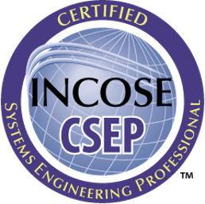

**Tom Westbury** is a systems engineer located in the midlands, currently helping to design the next generation of supercars. This blog contains his ideas on the subject of systems engineering and the theory behind it.

In his spare time Tom enjoys bellringing, climbing and trying to get his classic motorcycle to run.

{width=200px}

[{width=100px}](https://www.scrumalliance.org/get-certified) [{width=100px}](https://incoseuk.org/Normal_Files/Home)

