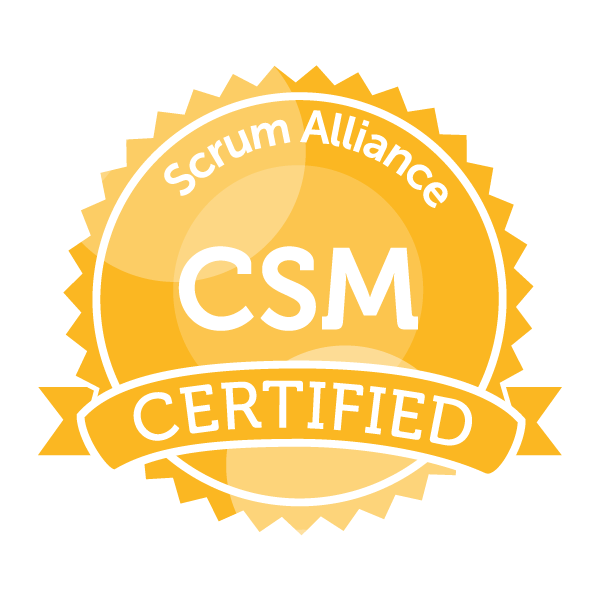

**Tom Westbury** is a systems engineer located in the midlands, currently working in an exciting engineering startup. This blog contains his ideas on the subject of systems engineering and the theory behind it. In his spare time Tom enjoys bellringing, climbing and trying to get his classic motorcycle to run.

[{width=100px}](https://www.scrumalliance.org/get-certified) [{width=100px}](https://incoseuk.org/Normal_Files/Home)
