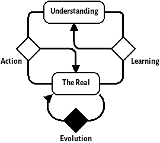

Whilst in a previous role, I found myself saying the same thing over and over to the Systems Engineers that I was training: *"Close the loop"*. The loop that I was referring to is the loop that is created from our stakeholder's desire, through a system that we control and back to the action we take that fulfils that desire. 

In an operational context, this could be a user's desire to toast bread, expressed by them putting bread into the toaster and pressing the go button. The loop is then closed when the toaster pops out the toast back to the user. 

In a larger context, this loop could be the user's expressed desire for the ability to make toast with the loop consisting of understanding that desire as requirements, designing a toaster, manufaturing that toaster, making it available for sale and then delivering that toaster to the user.

Whilst coaching systems engineers within that previous role, I often found that they would start their requirements analysis at a very low level---perhaps even starting by writing one requirement for a box that only did a portion of the behaviour required for a user feature.

# A Brief Aside Into Notation and Method

To describe the patterns in this post, I will use a minimalist notation that I've settled upon for describing dynamic systems. This is a simplified version of stock and flow diagrams used in systems dynamics. Rounded rectangles are used to represent variables and diamonds for processes that evolve them.

For example, here's a simple system:

{width=200px}

For the methodology, I'll be showing my working as subsequent applications of DSRP. Although it is [disputed](http://dx.doi.org/10.1016/j.evalprogplan.2008.04.002) whether DSRP is complete, it is a definitely simple framework and good enough for the purposes here. I have also used a few laws from various systems thinkers, a great summary of these laws can be found in the book [The Grammar of Systems: From Order to Chaos & Back](https://www.scio.org.uk/resources/grammar-systems-order-chaos-back).

# The Loop

Initially, we'll start from the most simple loop of *The Real* and the process by which it changes which we'll call *Evolution*. This leads us to a trivial system looking like this:

{width=200px}

## Doubling the Loop

Ashby's law of requisite variety states that a good regulator must have at least as much variety as the environment it controls. Therefore, alongside the environment, there must be a model of that environment that we can use to control it. Let's add that model in now. For reasons explained later, we'll call it *Understanding*:

{width=250px}

This *Understanding* model represents our understanding (funny, that) of the laws of physics and/or the environment which the system controls. It allows our feedback loop to become a *feedforward* loop. This means that instead of course correcting our systems interventions on the current state of the environment, we can predict where the environment will be and make our interventions based on that.

We must ask ourselves though, where does our *Understanding* come from? There's only one place it can come from---the *Environment*. However, our knowledge of the environment is incomplete; there will always be edge behaviours that will surprise us. The fact that we can never *completely* model a system is known as *the darkness principle*. 

Because of this, we cannot take our *understanding* model for granted---we must add another loop that modifies our *understanding* based on surprises (unencountered phenomena) from the *environment*. We can call this new process *learning*.

{width=250px}

The pattern that we now have is sometimes called the *Double loop learning* model. This pattern corresponds to places where we are actively updating our mental model---where we are improving our *feedforward* with *feedback*. This is a well understood pattern within Cybernetics and has permeated a lot of modern organisational thinking. It could be said that this pattern is the quintessential Cybernetic pattern.

## The Arrow of Desire

So far, we've developed a standard pattern for an adaptive system. There is a concept, though, that we've been implicitly talking about that we haven't accounted for in our pattern. That concept is the *purpose* or *goal* of the system.

To begin with talking about purpose and goals, we should first make a distinction in the *Understanding* model. If our system has a goal then it must be encoded in the *Understanding* therefore we can cut part of our *Understanding* with a distinction and call it *the Ideal*. This new distinction brings with it a new relationship that we'll call *Desire*. This new relationship is an input to both the *learning* and *action* releationships.

{width=300px}

The idea behind destinguishing *Desire* and *The Ideal* from *Understnding* is to model

{width=300px}

## Critique

The final relationship to create on the diagram is the one that changes *the Ideal*. 

{width=300px}

# The Desiring Machine

The model described above is 

@@ONLY THE Action and Learning loops can interact with the environment

## Self Similarity

Like many systems, Desiring machines are often self-similar---the processes within desiring machines are often themselves desiring machines.

# Dialectics of Desire

When we're working as an engineering firm, we embody a desiring machine. Our customers, be they individuals or organisations, also embody desiring machines. From the customer's perspective, our engineering firm looks like one of their *Intervention* processes (remember the part about how each of the processes may be a desiring machine itself). 

Now our viewpoint is an interesting one to take---we can either view the customer's requirements as a part of our environment or we can cut the customer's desiring machine out of the environment using a new distinction. The following diagram shows what that looks like:

{width=750px}

We can use this expansion of the model to gain some insights into @@

The 

# Conclusion

I have found the *Desiring Machine* pattern model useful in my own practice for understanding and diagnosing problems of systems engineering. I hope that I have explained it well enough here for others to understand it and to apply it in their own systems practice. I do not believe that I have added anything new during this inquiry, but I think the pattern is useful enough to warrant being named.

I'd be especially interested to know where it doesn't work well and additions/subtractions are greatly appreciated. Please put any thoughts that you might have in the comments below.

In future posts, I hope to expand on my ideas around the desiring machine, showing how it can be used to understand the viable systems model as well as other concepts in systems engineering. I'd also like to augment my model of the desiring machine with the idea of system cadences or rhythms to gain understanding of how the pattern changes when information flows at different rates around the system.

Finally, here are some key takeaways because who really wants to read the wall of text above?

Desiring machines

