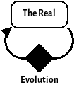
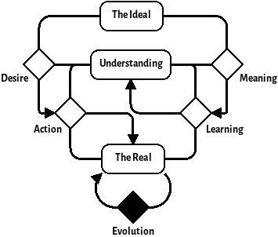

In this post, I will describe a pattern that I have identified in numerous places during my time as a systems engineer. This pattern sits somewhere between the traditional double-loop learning system and a viable system. I call this pattern the *Desiring Machine* as a nod to Deleuze as I feel that this pattern *feels* somewhat like a Deleuzian desiring machine. This post focusses mainly on the derivation of the pattern but I hope to expand on its uses as a framework for understanding and enquiry in future posts.  

# A Brief Aside Into Notation and Method

To describe the patterns in this post, I will use a minimalist notation that I've settled upon for describing dynamic systems. This is a simplified version of stock and flow diagrams used in systems dynamics. Rounded rectangles are used to represent variables and diamonds for processes that evolve them.

For example, here's a simple system:

{width=200px}

For the methodology, I'll be showing my working as subsequent applications of DSRP. Although it is [disputed](http://dx.doi.org/10.1016/j.evalprogplan.2008.04.002) whether DSRP is complete, it is a definitely simple framework and good enough for the purposes here. I have also used a few laws from various systems thinkers, a great summary of these laws can be found in the book [The Grammar of Systems: From Order to Chaos & Back](https://www.scio.org.uk/resources/grammar-systems-order-chaos-back).

# The Loop

Initially, we'll start from the most simple loop of *The Real* and the process by which it changes which we'll call *Evolution*. This leads us to a trivial system looking like this:

{width=100px}

I hope that you'll agree that this is an incredibly low resolution model of the universe. The reason why I've started here is because all systems are inscribed within the real. It's good to keep in mind that applications of DSRP are all about imposing structure on a Volatile, Unknowable, Complex and Ambiguous reality---everything that exists is already within this model, we just need recursive subsequent applications of DSRP to carve our more subtle patterns from it.

Ashby's law of requisite variety states that a good regulator must have at least as much variety as the environment it controls. Therefore, alongside the environment, there must be a model of that environment that we can use to control it. This model is part of *the Real* so we'll carve it out of the *Real* with a distinction. For reasons explained later, we'll call it *Understanding*:

{width=200px}

If we were following DSRP to the letter, the creation of a distinction across an element would cause the creation of two new elements within the system of the original. For the simplicity of the diagrams, we're ignoring the system part for now, as we're operating from the perspective of the desiring machine that we're deriving. I hope that this omission will not cause too much confusion.

The third part of making a distinction is the creation of the relationships between the two new elements created by the distinction. These relationships are what we used to define the purpose of our distinction so we must interrogate our motives. The reason for this enquiry is to understand a general pattern for systems that seek to modify the environment in the way they see fit, so the first relationship should be *Action*. *Action* is a process that takes in *The Real* and *Understanding* and modifies *The Real* towards some goal based on *Understanding*.

## Doubling the Loop

This *Understanding* model represents our understanding (funny, that) of the laws of physics and/or the environment which the system controls. It allows our feedback loop to become a *feedforward* loop. This means that instead of course correcting our systems interventions on the current state of the environment, we can predict where the environment will be and make our interventions based on that.

We must ask ourselves though, where does our *Understanding* come from? There's only one place it can come from---*the Real*. However, our knowledge of *the Real* is incomplete; there will always be edge behaviours that will surprise us. The fact that we can never *completely* model a system is known as *the darkness principle*. 

Because of this, we cannot take our *understanding* model for granted---we must add another loop that modifies our *understanding* based on surprises (unencountered phenomena) from *the Real*. We can call this new process *learning*.

{width=250px}

The pattern that we now have is sometimes called the *Double loop learning* model. This pattern corresponds to places where we are actively updating our mental model---where we are improving our *feedforward* with *feedback*. This is a well understood pattern within Cybernetics and has permeated a lot of modern organisational thinking. It could be said that this pattern is the quintessential Cybernetic pattern. For example, this pattern generalises the ubiquitous OODA loop model.

## The Arrow of Desire

So far, we've developed a standard pattern for an adaptive system. There is a concept, though, that we've been implicitly talking about that we haven't accounted for in our pattern. That concept is the *purpose* or *goal* of the system.

To begin with talking about purpose and goals, we should first make a distinction in the *Understanding* model. If our system has a goal then it must be encoded in the *Understanding* therefore we can cut part of our *Understanding* with a distinction and call it *the Ideal*. However, it is also equally valid to make this distinction out of *the Real* too---*the Ideal* could just as easily be outside of the scope of our system's perspective. This is why I've neglected the systems part of DSRP because, depending on the situation, the desiring machine pattern can be cut up by system boundaries in many ways. This new distinction brings with it a new relationship that we'll call *Desire*. This new relationship is an input to the *Action* process.

{width=300px}

*Desire* is the difference between *Understanding* and *the Ideal*. 

{width=300px}

## Critique

The final relationship to create on the diagram is the one that changes *the Ideal*. 

{width=300px}

# The Desiring Machine

The model described above is 

@@ONLY THE Action and Learning loops can interact with the environment

One point to keep in mind when identifying *the Ideal* of a desiring machine in reality is that what may at first appear to be an organisation's goal may not be its goal at all. Stafford Beer's rule *the purpose of a system is what it does* is incredibly useful in this context for identifying the actual *Ideal* of a system. An organisation may have a stated goal and set of values but identifying what information a system accepts or rejects into its *understanding* (its *Meaning* process) and identifying what causes changes in its *Action* processes (its *Desire*) will give you pointers to what the true *Ideal* of that system is.

## Self Similarity

Like many systems, Desiring machines are often self-similar---the processes within desiring machines are often themselves desiring machines.

When we're working as an engineering firm, we embody a desiring machine. Our customers, be they individuals or organisations, also embody desiring machines. From the customer's perspective, our engineering firm looks like one of their *Action* processes (remember the part about how each of the processes may be a desiring machine itself). Note that it's not 'Desiring Machines all the way down'; the end of the chain of Desire is often just a single or double cybernetic loop acting upon *the Real*. 

Now our viewpoint is an interesting one to take---we can either view the customer's requirements as a part of our environment or we can cut the customer's desiring machine out of the environment using a new distinction. The following diagram shows what that looks like:

{width=750px}

This is just one place where the framework of desiring machines becomes useful in understanding problems of engineering. From the diagram we can see that we have no direct measure of our customer's desire; what we think of as their requirements

# Conclusion

I have found the *Desiring Machine* pattern model useful in my own practice for understanding and diagnosing problems of systems engineering. I hope that I have explained it well enough here for others to understand it and to apply it in their own systems practice. I do not believe that I have added anything new during this inquiry, but I think the pattern is useful enough to warrant being named.

I'd be especially interested to know where it doesn't work well and additions/subtractions are greatly appreciated. Please put any thoughts that you might have in the comments below.

In future posts, I hope to expand on my ideas around the desiring machine, showing how it can be used to understand the viable systems model as well as other concepts in systems engineering. I'd also like to augment my model of the desiring machine with the idea of system cadences or rhythms to gain understanding of how the pattern changes when information flows at different rates around the system. There's also some interesting insights to be had when the S part of DSRP is put back in so that we have different ways of cutting up the desiring machine with system boundaries.
