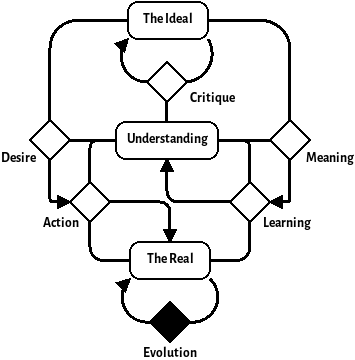

I mentioned in a previous post that the Desiring Machine pattern lies somewhere between a cybernetic loop and a Beerian Viable System in the zoo of cybernetic patterns. In this post, I would like to expain what I meant by that as well as using the framework of interacting desiring machines to understand some system pathologies. First, however, lets have a refresh of what a desiring machine is.

The Desiring Machine
--------------------

The Desiring Machine is a pattern to which some systems may conform. It typifies systems that make changes in their environment based on a goal that can change based on processes internal to the system. This differentiates it from systems like homeostats where the goal of the system is set externally. The basic form of a Desiring Machine is shown here:

{width=500px}

The key states in a desiring machine are:

The Environment

  : The surroundings of the desiring machine that the machine exists within

Understanding

  : The Desiring Machine's model of its environment.

Ideal

  : A model of what an ideal environment looks like to the desiring machine with regards to its understanding.

And the key processes of the Desiring Machine are:

Learning

  : The ability for the system to produce and update an Understanding from observations on the environment.

Action

  : The ability for the system to make changes on its environment using its Understanding and observing the environment.

Meaning

  : The ability for a system to filter its learning based on what is important for it to understand based on its ideals

Desire

  : The ability for the system to guide its actions based on moving the environment towards its ideal state

Critique

  : The ability for a system to develop and evolve an ideal.

Desiring Machines as an OODA loop
---------------------------------

The OODA loop is a pattern for understanding how to win competitions between cybernetic systems. The acronym stands for Observe, Orient, Decide and Act---the four stages that any system has to go through to make changes in its environment. The Desiring Machine pattern's Learning process covers the Observe and Orient while Action covers Decide and Act.  

Viable Desiring Machines
------------------------

Stafford Beer's Viable system model is a cybernetic pattern that allows us understand whether a system is viable and what may be missing from a system that is not. It is constructed of 5 sub-systems that all have purposes that culminate in the viability of the system. A great explainer of the VSM can be found here @@. These systems and how they are related to the Desiring machine are listed below:

System 1

  : The sub-system that brings value by acting upon the environment of the system. This is the Action process of the Desiring Machine.

System 2

  : The sub-system that monitors the multiple System 1s and ensures that there are no contradictions between the actions of these systems.

System 3

  : This sub system 

System 4

  : This sub-system monitors the environment and attempts to 

System 5

  : This sub-system maintains the 'ethos' of the system. It does acts as th @@ In terms of the Desiring Machine, System 5 comprises the Ideal and the processes of Critique, Desire and Meaning. An important point to make here 

Of course, pa

Pathologies of the Desiring Machine
-----------------------------------

We have covered the relations between the OODA loop, VSM and the Desiring Machine. The OODA loop is a great model for understanding how to win inter-system conflicts whereas the VSM is a model for understanding how to build cohesive and resilient (viable) systems. The desiring machine, sits in between these two in this sense too by giving us a framework to understand intra-system conflicts, namely those that happen between levels of hierarchy.

One such pathology occurs when one desiring machine in a heirarchy of desiring machines becomes viable when it shouldn't. To illustrate this point, imagine a car engineering firm which designs internal combustion engine driven vehicles. The company itself is a viable desiring machine and so are the engineers who work in the firm. Between the level of the firm and the level of the employee, however, is the departmental level. In this example, one of these departments is the engine design department.

The engine design department is itself a viable desiring machine with its Desire, Meaning and Critique processes conducted by the Engine Design Chief Engineer and their team of managers.

