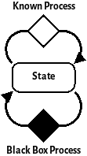
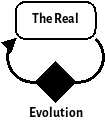
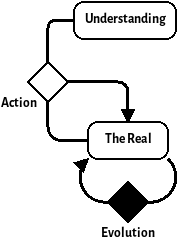
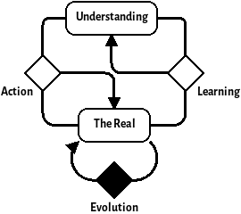
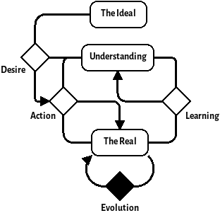
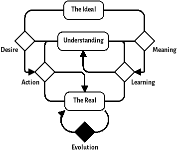
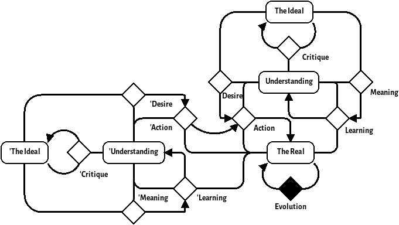

In this post, I will describe a pattern that I have identified in numerous places during my time as a systems engineer. This pattern sits somewhere between the traditional double-loop learning system and a viable system. I call this pattern the *Desiring Machine* as a nod to Deleuze as I feel that this pattern *feels* somewhat like a Deleuzian desiring machine. This post focusses mainly on the derivation of the pattern but I hope to expand on its uses as a framework for understanding and enquiry in future posts. I will add that I do not believe that this pattern is anything new; I have seen aspects of it expressed in various systems thinking texts. However, I don't think the pattern has been addressed by name or given the recognition as a useful pattern in the way I believe it deserves.

<!--more-->

# A Brief Aside Into Notation and Method

To describe the patterns in this post, I will use a minimalist notation that I've settled upon for describing dynamic systems. This is a simplified version of stock and flow diagrams used in systems dynamics. Rounded rectangles are used to represent variables and diamonds for processes that evolve them.

For example, here's a simple system:

{width=200px}

For the methodology, I'll be showing my working as subsequent applications of DSRP. Although it is [disputed](http://dx.doi.org/10.1016/j.evalprogplan.2008.04.002) whether DSRP is complete, it is a definitely simple framework and good enough for the purposes here. I have also used a few laws from various systems thinkers, a great summary of these laws can be found in the book [The Grammar of Systems: From Order to Chaos & Back](https://www.scio.org.uk/resources/grammar-systems-order-chaos-back).

# The Loop

Initially, we'll start from the most simple loop of *The Real* and the process by which it changes which we'll call *Evolution*. This leads us to a trivial system looking like this:

{width=100px}

I hope that you'll agree that this is an incredibly low resolution model of the universe. The reason why I've started here is because all systems are inscribed within the real. It's good to keep in mind that applications of DSRP are all about imposing structure on a Volatile, Unknowable, Complex and Ambiguous reality---everything that exists is already within this model, we just need recursive subsequent applications of DSRP to carve our more subtle patterns from it.

Ashby's law of requisite variety states that a good regulator must have at least as much variety as the environment it controls. Therefore, alongside the environment, there must be a model of that environment that we can use to control it. This model is part of *the Real* so we'll carve it out of the *Real* with a distinction. For reasons explained later, we'll call it *Understanding*:

{width=200px}

If we were following DSRP to the letter, the creation of a distinction across an element would cause the creation of two new elements within the system of the original. For the simplicity of the diagrams, we're ignoring the system part for now, as we're operating from the perspective of the desiring machine that we're deriving. I hope that this omission will not cause too much confusion.

*ERRATUM: I have come to the realisation that the Real should be replaced by the Environment in the following diagrams. The Environment being a small part of the Real that we care about. The Darkness principle (a result of Ashby's law) prevents us from making a Desiring Machine that can cope with all of the Real despite what the MIT school might attempt* 

The third part of making a distinction is the creation of the relationships between the two new elements created by the distinction. These relationships are what we used to define the purpose of our distinction so we must interrogate our motives. The reason for this enquiry is to understand a general pattern for systems that seek to modify the environment in the way they see fit, so the first relationship should be *Action*. *Action* is a process that takes in *The Real* and *Understanding* and modifies *The Real* towards some goal based on *Understanding*.

## Doubling the Loop

This *Understanding* model represents our understanding (funny, that) of the laws of physics and/or the environment which the system controls. It allows our feedback loop to become a *feedforward* loop. This means that instead of course correcting our systems interventions on the current state of the environment, we can predict where the environment will be and make our interventions based on that.

We must ask ourselves though, where does our *Understanding* come from? There's only one place it can come from---*the Real*. However, our knowledge of *the Real* is incomplete; there will always be edge behaviours that will surprise us. The fact that we can never *completely* model a system is known as *the darkness principle*. 

Because of this, we cannot take our *understanding* model for granted---we must add another loop that modifies our *understanding* based on surprises (unencountered phenomena) from *the Real*. We can call this new process *learning*.

{width=250px}

The pattern that we now have is sometimes called the *Double loop learning* model. This pattern corresponds to places where we are actively updating our mental model---where we are improving our *feedforward* with *feedback*. This is a well understood pattern within Cybernetics and has permeated a lot of modern organisational thinking. It could be said that this pattern is the quintessential Cybernetic pattern. For example, this pattern generalises the ubiquitous OODA loop model.

## The Arrow of Desire

So far, we've developed a standard pattern for an adaptive system. There is a concept, though, that we've been implicitly talking about that we haven't accounted for in our pattern. That concept is the *purpose* or *goal* of the system. From this point forward, we will define that only *Action* and *Learning* can be used to interact with *the Real*. This constraint is justified by the assumption that internal processes of a system can only operate upon the *understanding* of the system.

To begin with talking about purpose and goals, we should first make a distinction in the *Understanding* model. If our system has a goal then it must be encoded in the *Understanding* therefore we can cut part of our *Understanding* with a distinction and call it *the Ideal*. However, it is also equally valid to make this distinction out of *the Real* too---*the Ideal* could just as easily be outside of the scope of our system's perspective. This is why I've neglected the systems part of DSRP because, depending on the situation, the desiring machine pattern can be cut up by system boundaries in many ways. This new distinction brings with it a new relationship that we'll call *Desire*. This new relationship is an input to the *Action* process.

{width=300px}

*Desire* is the difference between *Understanding* and *the Ideal*. It therefore acts as an error signal that drives *Action*. That is to say that if *the Ideal* and *Understanding* do not differ, there will be no desire and therefore *Action* will not occur. A larger difference between *Understanding* and *the Ideal* creates a larger *Desire* signal and therefore drives greater *Action*. Depending on the desiring machine, *Desire* can be a multi-dimensional vector whose basis may not be orthogonal---that is to say, that more complex desiring machines can produce conflicting *Desire* which is caused by inconsistencies in *The ideal* and/or *Understanding*.

*Desire* is not the only relationship between *the Real*, *Understanding* and *the Ideal*. The *Learning* process is also guided by the difference between *Understanding* and *the Ideal*. This signal is analogous to the idea of attention--it acts as a filter of what information from *the Real* is worth incorporating into *Understanding*. For now we will call it *Meaning*:

{width=300px}

*Meaning* is an important signal within the desiring machine as it ensures that the *understanding* does not get overwhelmed with information that is not relevant to the goals of the system. Along with *Desire*, *Meaning* can be used as a lens to understand many pathologies of systems.

## Critique

The final relationship to create on the diagram is the one that changes *the Ideal*. As a desiring machine only has access to *the Real* through *Learning* and *Action*. This is added as the process that creates and modifies *the Ideal* and therefore sets the goals of the desiring machine. Without it, there could be no *Ideal* as this process is the one that creates the distinction internally to the *Understanding* between what is and what is *Ideal*. On the diagram, it looks like this:

{width=300px}

This diagram demonstrates the pattern of the desiring machine. In future posts I will explore how this pattern can be used as a lens to understand some pathologies within systems but first we will explore how different desiring machines can interact as different levels of abstraction hierarchy.

## Self Similarity

Like many systems, Desiring machines are often self-similar---the processes within desiring machines are often themselves desiring machines. When we're working as an engineering firm, we embody a desiring machine. Our customers, be they individuals or organisations, also embody desiring machines. From the customer's perspective, our engineering firm looks like one of their *Action* processes (remember the part about how each of the processes may be a desiring machine itself). Note that it's not 'Desiring Machines all the way down'; the end of the chain of Desire is often just a single or double cybernetic loop acting upon *the Real*. 

The viewpoint of an *Action* process as a desiring machine is an interesting one to take---we can think of the example of an engineering firm that's developing a system for a customer organisation. We can either view the customer's requirements as a part of our environment or we can distinguish the customer's desiring machine out of the environment using a new distinction. The following diagram shows what that looks like:

{width=600px}

*ERRATA: The Customer Desiring Machine should be connected to the Learning Process of the lower-level Desiring Machine*

The primes show the process and parts of the customer desiring machine. We can use this diagram as a lens to understand some of the pathologies caused by the hierarchy of two
desiring machines. For example, the desire of the customer is filtered through both the customer's *understanding*, the engineering firm's *meaning* and the engineering firm's *understanding*. This means that the less the two understandings match (and the less meaningful engineer's find the requirements) the less the engineered solution will meet the customer's desire. This is an effect that I'd like to explore further in a future post.

# Conclusion

I have found the *Desiring Machine* pattern model useful in my own practice for understanding and diagnosing problems of systems engineering. I hope that I have explained it well enough here for others to understand it and to apply it in their own systems practice. I do not believe that I have added anything new during this inquiry, but I think the pattern is useful enough to warrant being named.

I'd be especially interested to know where it doesn't work well and additions/subtractions are greatly appreciated. Please put any thoughts that you might have in the comments below.

In future posts, I hope to expand on my ideas around the desiring machine, showing how it can be used to understand the viable systems model as well as other concepts in systems engineering. I'd also like to augment my model of the desiring machine with the idea of system cadences or rhythms to gain understanding of how the pattern changes when information flows at different rates around the system. There's also some interesting insights to be had when the S part of DSRP is put back in so that we have different ways of cutting up the desiring machine with system boundaries.
