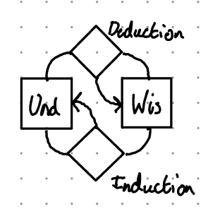

Back in 2021, I interviewed for a job in Model Based systems Engineering. During the interview, one of the interviewers hit me with the question:

> What is system Architecture?

He clarified by asking what distinguishes architecture from design. A daunting question, especially as the interviewer was the author of a well known primer on systems architecture that I'd not long ago read. I got the job, but I was unhappy with my answer to the question. Three years and a lot of self research into cybernetics later, I think I'm ready to give an answer that I'm happy with. On the way to answer this question we'll meet a mad major who could build snowmobiles and the Architect (of buildings) whose work paved the way for MBSE.

<!--more-->

Later, the man who interviewed me explained that he saw architecture as a tendency distinct from design but still intrinsically linked---whereas design moves towards solving the problem at hand, architecture abstracts, finds patterns (keep this word in mind!). At the time this was revelatory. Architecture to me before then was a stage before design but somehow less so. You must excuse young Tom---I'd just got my CSEP badge and was locked into a very chronologically strict Vee model in thinking. This thought wedged a crowbar into the cracks in that mental model.  I am an engineer and a modeler, so I couldn't leave this at the level of fuzzy things like 'tendencies'. I needed a precise model of the dialectic of architecture and design.

## The Architect

In the 70s the architecture world was dominated by modernism. Driven by advances in art, philosophy, developments in materials and, of course, the necessity of rebuilding from two disastrous world wars, cubic concrete buildings began appearing everywhere. Though some in the architecture world were critical of Brutalism and similar styles. One such dissident was Christopher Alexander.

Alexander, influenced by nascent cybernetics, began looking for a *timeless* way to conduct the creation of buildings and towns. His work during this period takes on a Promethean character--- Alexander worked to collaborate with and empower the very people who would live, work and use the spaces he architected. This culminated in a transformative project at the University of Oregon. A trilogy of books was produced out of this period:

The Timeless way of Building

 : A beautiful and poetic book laying out Alexander's belief system behind his architecture practice and an attempt at describing and capturing the *quality with no name* that exudes from certain buildings---a sense of life, belonging & purpose.

A Pattern Language

: A collaborative effort guided by Alexander to develop a set of patterns that can be used by anyone to design better spaces to exist in.

The Oregon Experiment 

: An account of how the theory set out in the first two books was put into practice at the University of Oregon.

Alexander's treatment of the *quality with no name* and his later development of this into an idea of *life* that certain objects and buildings possess deserves a proper treatment elsewhere. Here though, we're more interested in his pattern language.

A Pattern Language is a phenomenal work. The book aims to arm normal people and communities with a language with which they can use to design their own spaces. As well as a large collection of patterns, the book contains guidelines for using the patterns and discovering your own.

Looking at Alexander's projects, he often achieved his goals. His buildings often do feel timeless, reflecting their environment and the human activities and relationships that they support. However, unlike many famous architects of the period, his buildings do not stand out as *his*. Perhaps this is the reason that his mark on the modern architectural canon is small.

However, the software engineering world took Alexander's ideas and ran with them, especially in the C++/Java/OOP community. This current led to the (in)famous Gang of Four Software Design Patterns book which has become an integral part of the very culture of Java programmers.It was then inherited by the UML and later SysML communities which has resulted in some great work in the discovery of modelling patterns such as those documented by the INCOSE UK MBSE Working Group.

This idea of finding patterns in design and abstracting up is not new---Alexander often alluded to his work as discovery rather than invention. In the mid-70s, while Alexander was writing his trilogy, an American ex-pilot was beginning his work that would revolutionize war.

## Snowmobiles

As Alexander was developing architectural pattern languages, an Officer in the US Air Force was ruminating on the aftermath of the Vietnam and Korean Wars. John Boyd had already made a name for himself with his development of Energy-Manoeuvrability theory in the 1960s which influenced the design of the F-15. A maverick, he was known for stealing computer time to run simulations of his theory. His nickname, 40 second Boyd, was earned from his application of E-M Theory enabling him to win simulated dog fights by baiting opponents into a tail chase---something that was believed to be a certain kill scenario---before using his opponent's own energy against them to shoot them down.

In 1976, Boyd published a paper entitled [*Destruction and creation*](https://www.coljohnboyd.com/static/documents/1976-09-03__Boyd_John_R__Destruction_and_Creation.pdf). This paper was built on his wealth of experience during Korea and Vietnam as well as his keen interest in contemporary science.  Boyd's focus in the paper was to map processes of thinking to improve warfighting. Destruction is Boyd's process of taking existing solutions and tearing them apart. Creation is the opposite process of building up those parts into new things.  Boyd's later analogy was that winning militaries can build snowmobiles. Militaries already have tanks, boats, motorcycles &c. but, if faced with snow, they get stuck. Yet hidden in their existing equipment are tank tracks, boat bodies, motorcycle engines---all the parts for snowmobiles are there. If that force is empowered to tear apart their vehicles and build snowmobiles.

Boyd's Destruction & Creation map to the ideas of Deduction & Induction or Abstraction & Reification. It's all about continuously building a playbook of moves (Patterns!) which you can use to apply to new situations. Boyd continued this thinking forward into his later work on the OODA loop framework and his patterns of conflict presentation. His contribution to modern Manoeuvre warfare cannot be understated and the use of tactics such as thunder runs with devastating effect in Iraq and Ukraine, draw on Boyd's legacy.

## Modelling Boyd & Alexander

I'm a model based systems engineer---this gives me a drive to give the fuzzy precise definition, especially if done in a pictorial manner. We'll start, as in previous posts, with the Cybernetic loop model of engineering:

{width=300px}

To recapitulate this model, there are two entities:

**The Environment (Env)**

: Represents the states of the environment that we're trying to engineer.

**Understanding (Und)**

: Our model of the environment that allows us to navigate the Environment.

Then there are the processes, represented as diamonds:

**Evolution**

: The process of the environment changing.

**Learning**

: The process of updating our understanding by observing the environment.

**Action**

: The process of using our understanding to change our environment.

**Development**

: The process of updating our understanding based upon itself.

It is the development loop that we're going to focus on in this part of the essay.

Boyd's Destruction & Creation implies that our development process is actually *two* processes---one of deduction, destruction or abstraction and one of induction, creation or reification. What are we doing with those abstractions? Well, another name for an abstraction is a *Pattern*.

Destruction & creation are the processes of creating/updating and using a *Pattern Library*.

Let's see how that looks as a diagram.

{width=300px}

I've given the name *wisdom* to the Pattern library as a more generic name. It is worth noting that Deduction is not required for an engineering process to build understanding via Induction. I'd like to dig into this at a later date by using this simple model as a diagnostic framework, especially with how it links to the concept of technical debt, but for now we'll focus on architecture.

## What is architecture vs design?

Before we answer the question originally posed in this essay, we should probably make a point on the descriptive nature of the English Language. The Oxford English Dictionary takes a descriptivist approach to English---it records the English language as it's used, not how it should be used. Despite what your English teacher told you, there is no correct way to use English, just keep in mind that others need to faithfully understand what you write. 

Using words against their dictionary definitions or constructing non-standard grammatical sentences enables us to express and emphasize thoughts in ways that Academie Français French would forbid. As an English speaker, know that you are empowered to boldly split infinitives whenever you please.

Given this, Architecture is a loaded word. Yes we have freedom to use it wherever we want, but we've got to keep in mind that the usage is loaded with pre-existing meaning. Therefore, using the model constructed in the last section, I'd like to propose a definition of architecture and design based on the deduction-induction loop.

Architecture is the tendency to exercise the deduction process whereas design is the tendency to exercise the induction process.

To make this concrete by referring to job roles, a system architect's job is to facilitate the identification, recording and usage of design patterns within a project whereas system designers focus on the application of patterns to the problem at hand.

 Therefore, a system architecture is a collection of patterns and rules for their application that allows designers to complete their role quickly on subsequent problems. This is embedded in the adage *let's not reinvent the wheel*. The wheel is a pattern---without a pattern language/wisdom repository we're doomed to reinvent it each time we encounter the problem of moving heavy things.

I believe that the definition proposed here somewhat matches the common usage and that used in the ISO 420XX Series of standards. I've certainly found the loop of *Understanding-Deduction-Wisdom-Induction* a useful diagnostic tool in my work as a Principal Systems Engineer As always, I'm interested in your thoughts on the above---do you agree? Have I missed something important or lost the plot entirely! Drop me an email or comment below.

Before we finish here, I'd like to leave you with a couple of ways that I incorporate this thinking into my day-to-day work.

## Systems Architecture Praxis

There are two main ways that I incorporate this idea of architecture into my team's praxis. The first relies on our use of MBSE, but the second is applicable to any area of engineering (or even life!). Before I explain those though, its worth noting that the documentation of processes, methods & standards is an important part of the Architecture loop---after all a process or standard is a pattern that's indispensable.

Otherwise, the two ways that I incorporate architecture into my team's praxis are a domain specific language and a pattern
library.

### Living Domain Specific Language

One way to think of a pattern language is as a form of information compression for human communication---a pattern being understood by two individuals allows the short Utterance of a few words to unfold into a whole host of attributes & relationships in the listeners' head.

When following Model based systems Engineering (MBSE), stereotypes and/or Metaclasses can be used to encode these patterns. In my current project we use a Domain specific language instead of SysML. This enables us to more precisely define the meanings of each metaclass, their standard attributes and their allowed relationships.

Our deduction loop comes into play when we find ourselves unable to easily model a concept in the language, or, we find ourselves creating the same pattern of attributes and relationships again and again. We can easily create new metaclasses to cover these cases and adapt our modelling language on the fly.

If you find yourself using SysML or UML, stereotypes, tags and profiles work well for this purpose. In fact, I have a strongly held opinion of little consequence that profiles are necessary for SysML modelling to reduce ambiguity. The key is to ensure that you are continuously evaluating and updating your profile and refactoring your model as it changes. Otherwise, your profile will become overly constraining and make work harder than it needs to be.

### A Pattern Wiki

Connected to our modelling but to also cover patterns in other areas, we created a pattern wiki. A pattern wiki is a searchable repository for patterns that your team discovers. Any searchable tool is good for this. Common corporate tools that are great for this are Atlassian confluence or Microsoft Office One Note---it just needs to be a searchable, linkable, shared repository of knowledge.

Each pattern should have its own linkable section or page. Here's the pattern that I use for patterns (A meta pattern!) as a start point. As Cunningham's ^[the inventor of Wikis] law states, the best way to elicit a correct answer is to present a wrong answer. This metapattern is presented hoping that you'll adapt it to your own needs.

#### A Template for Patterns

Summary

: A short description of the pattern.

Problem

: A description of the problem that the pattern solves, so you know when to apply it.

Description

: A description of the pattern and how to implement it.

Related

: A set of links to other patterns mentioned in the description and other related patterns.

We've also categorized our patterns based on whether they are for our work products or whether they cover ways of working. We also link out to collections of patterns that work well in certain circumstances. Examples are TRIZ resources for problem solving or the Grammar of Systems book for systems Thinking.

Based on this, I'm putting together a project for a systems engineering pattern wiki following the pattern above. I will write more on it once its up and running, but I hope that it will become a collaborative affair for a discipline-wide Architecture loop. If you'd be interested in this endeavour, drop me an email via my about page.